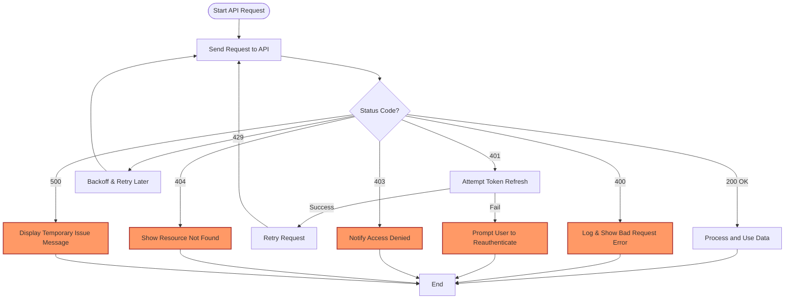

# Error Handling & Status Codes

When integrating with the RunRL Docs API, understanding common error patterns, status codes, and how to handle failures is critical to building robust applications that gracefully respond to unexpected events. This page guides you through practical use cases involving error responses, the structure and meaning of HTTP status codes returned by the API, and best practices to help you proactively manage edge cases in your integrations.

---

## Why Error Handling Matters

Every API interaction involves variability—network issues, permission errors, malformed requests, or internal problems can all interrupt the expected data flow. Anticipating these errors and responding effectively ensures your application delivers a reliable experience, minimizes downtime, and enhances user trust.

### Your Goal
- Detect problems early
- Provide clear, actionable feedback
- Implement retry or fallback logic where appropriate
- Maintain security and avoid information leaks


---

## Understanding API Status Codes

RunRL Docs API uses standard HTTP status codes to indicate the result of a request. Here are key codes and their meaning in the context of the API:

| Status Code | Meaning                    | When It Happens                                |
|-------------|----------------------------|-----------------------------------------------|
| 200 OK      | Request successful          | Your request was processed correctly           |
| 400 Bad Request | Client request malformed | Missing or invalid parameters                   |
| 401 Unauthorized | Authentication failed    | Invalid or missing authentication token        |
| 403 Forbidden | Permission denied          | Valid authentication but insufficient rights   |
| 404 Not Found | Resource not available     | Requested endpoint or data does not exist      |
| 429 Too Many Requests | Rate limit exceeded   | You are sending too many requests too quickly  |
| 500 Internal Server Error | Server failure      | Unexpected error in the API                      |


<Callout title="Tip" type="info">
Always check the status code before processing response data. Only proceed if the status is 200 OK to avoid unexpected behavior.
</Callout>


---

## Common Error Scenarios & How to Handle Them

Here are situations you'll encounter regularly, with recommended responses:

### 1. Authentication & Authorization Failures (401, 403)

**What happens:** Your API key or bearer token is missing, invalid, or lacks permission.

**How to react:**
- Validate that tokens are correctly included in the `Authorization` header.
- Prompt the user to re-authenticate or refresh tokens.
- Check for requested scope vs. granted scope mismatch.

### 2. Invalid Request (400 Bad Request)

**What happens:** Missing required parameters, bad JSON payload, or improper query syntax.

**How to react:**
- Validate request payloads client-side before sending.
- Log and display specific error messages returned in the response.
- Refer to endpoint documentation to ensure correct request format.

### 3. Resource Not Found (404 Not Found)

**What happens:** The endpoint or resource you requested does not exist.

**How to react:**
- Verify URL paths and parameters for accuracy.
- Provide fallback UI or messages informing users the resource is unavailable.

### 4. Rate Limiting (429 Too Many Requests)

**What happens:** You exceed allowed request limits.

**How to react:**
- Implement exponential backoff or waiting mechanisms before retrying.
- Cache frequently requested data to reduce calls.
- Monitor rate limit headers to anticipate throttling.

### 5. Internal Server Error (500)

**What happens:** Unexpected error on API server side.

**How to react:**
- Inform users of temporary issues gracefully.
- Retry after a delay, with limits.
- Report errors to support if persistent.


---

## Error Response Structure

When the API returns an error, the response body follows a consistent JSON schema to help you diagnose the issue swiftly:

```json
{
  "error": {
    "code": "string",        // e.g., "BadRequest", "Unauthorized"
    "message": "string",     // Human-readable description
    "details": [               // Optional array of additional info
      {
        "field": "string",   // Parameter or section related to error
        "issue": "string"    // Explanation of the specific problem
      }
    ]
  }
}
```

This structure makes it easy to parse errors programmatically and provide contextual feedback to your users.

---

## Best Practices for Robust API Error Handling

Follow these guidelines to implement effective error management:

- **Always check HTTP status codes before processing response bodies.**
- **Parse and log error details to diagnose issues quickly.**
- **Use client-side validation to reduce avoidable server errors.**
- **Implement retry logic with exponential backoff for transient errors (429, 500).**
- **Provide user-friendly error messages based on error code and context.**
- **Securely handle authentication tokens and refresh when needed to avoid 401 errors.**
- **Monitor your application logs and rate limiting headers to adjust usage patterns.**


---

## Example Error Handling Flow

This flowchart visualizes a typical API request lifecycle including error detection and handling:




---

## Troubleshooting Common Error Scenarios

<AccordionGroup title="Troubleshooting Guide">
<Accordion title="Authentication Failures (401 Unauthorized)">
Ensure your API key or bearer token is correctly included in the `Authorization` header. Confirm token validity and scope permissions. Refresh tokens if expired.
</Accordion>
<Accordion title="Malformed Request (400 Bad Request)">
Check your endpoint parameters and payload format carefully. Use the API reference for exact field types and required parameters.
</Accordion>
<Accordion title="Resource Not Found (404)">
Verify endpoint URLs and resource identifiers for typos or outdated references.
</Accordion>
<Accordion title="Rate Limiting (429 Too Many Requests)">
Implement client-side throttling or caching. Monitor `Retry-After` headers and space out API calls accordingly.
</Accordion>
<Accordion title="Server Errors (500)">
Report persistent issues to support. Confirm you're not sending malformed data that triggers server exceptions.
</Accordion>
</AccordionGroup>


---

## Final Notes

Error handling is a crucial part of your integration with RunRL Docs API. By designing thoughtful error detection, informative user feedback, and resilient retry strategies, your applications will provide a seamless experience even when things occasionally go wrong.

For further insights:
- Review [Authentication & Authorization](https://docs.runrl.com/api-reference/auth-and-errors/authentication) for managing tokens effectively.
- Explore [Troubleshooting Common Issues](https://docs.runrl.com/guides/usage-patterns/troubleshooting) for diagnostic strategies.
- Consider [Endpoint Overview](https://docs.runrl.com/api-reference/core-api/endpoint-overview) to understand typical API interaction patterns.

Together, these resources build a strong foundation for stable, secure, and user-friendly RunRL integrations.

---

## Code Example: Basic Error Handling in JavaScript

```javascript
async function fetchDocumentation(query, token) {
  try {
    const res = await fetch(`/api/search?q=${encodeURIComponent(query)}`, {
      headers: {
        'Authorization': `Bearer ${token}`,
        'Accept': 'application/json'
      }
    });

    if (res.ok) {
      const data = await res.json();
      return data;
    } else {
      const error = await res.json();
      console.error(`Error ${res.status}: ${error.error.message}`);
      // Handle specific status cases
      switch (res.status) {
        case 401:
          alert('Authentication failed. Please login again.');
          break;
        case 429:
          alert('Rate limit exceeded. Please wait before retrying.');
          break;
        default:
          alert(`Request failed: ${error.error.message}`);
      }
      return null;
    }
  } catch (e) {
    console.error('Network or unexpected error:', e);
    alert('An unexpected error occurred. Please try again later.');
    return null;
  }
}
```

---

This documentation equips you with a practical understanding of error signals from the RunRL Docs API and empowers you to handle them effectively to maintain application stability and user satisfaction.

---

<footer>
  Last updated: 2024-06
</footer>
