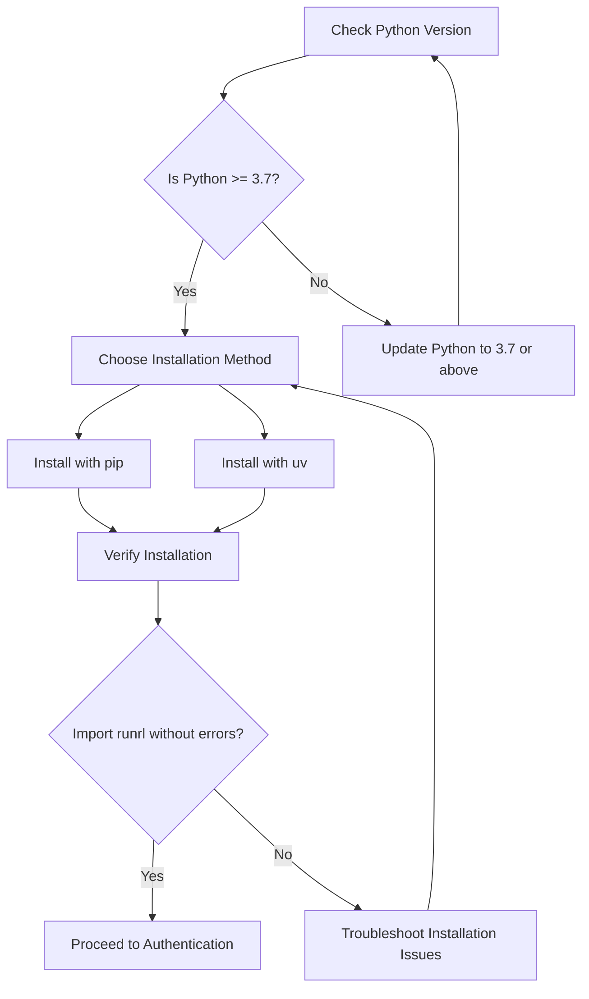

# Installation Guide for RunRL

Get your RunRL Python client up and running with this clear, step-by-step installation guide. Whether you're on Windows, macOS, or Linux, follow the instructions below for a clean and successful setup.

---

## 1. Requirements

Before installing RunRL, ensure your system meets the following prerequisites:

- **Python Version:** 3.7 or higher
- **Python Package Manager:** pip (standard) or uv (alternative)
- **Internet access:** Needed for downloading packages

<Check>
Verify your Python version with:
```bash
python --version
```
Should return `Python 3.7.x` or newer.
</Check>


## 2. Installing RunRL

RunRL can be installed easily with standard Python package managers.

### Using pip (Recommended)

Open your terminal or command prompt and enter:

```bash
pip install runrl
```

### Using uv

If you prefer uv, run:

```bash
uv pip install runrl
```

### Installing a Specific Version

To install a specific version, for example 0.1.15:

```bash
pip install runrl==0.1.15
```

Or with uv:

```bash
uv pip install runrl==0.1.15
```

### Upgrading RunRL

Keep your client up to date easily:

```bash
pip install --upgrade runrl
```

Or with uv:

```bash
uv pip install --upgrade runrl
```

### Installing from Source (For Developers)

If you want to contribute or test the latest development build:

1. Clone the repository:

```bash
git clone https://github.com/runrl/runrl.git
```
2. Navigate to the project folder:

```bash
cd runrl
```
3. Install in editable mode:

```bash
pip install -e .
```

Or with uv:

```bash
uv pip install -e .
```


## 3. Verifying Your Installation

Confirm that RunRL is installed and accessible:

1. Open a Python shell:

```bash
python
```
2. Try importing and checking the version:

```python
import runrl
print(runrl.__version__)
```

Expected Result: The installed RunRL version number prints without errors.

<Warning>
If you encounter an ImportError or see a version mismatch, check that your Python environment and PATH are correctly set up and that the installation completed without errors.
</Warning>

## 4. RunRL Dependencies

RunRL automatically installs its required Python libraries including:

- `requests` - Handles API communications
- `websockets` - Supports streaming data
- `asyncio` - Manages asynchronous operations

These dependencies are installed alongside RunRL when using pip or uv.

## 5. Platform-Specific Tips

### Windows

- Run the command prompt or PowerShell as administrator if you face permission issues.
- Ensure Python and pip executables are added to your system PATH.

### macOS/Linux

- Use `sudo` for system-wide installation if necessary:

```bash
sudo pip install runrl
```

- Prefer using virtual environments (e.g., `venv` or `conda`) to avoid permission conflicts and manage dependencies cleanly.

## 6. What’s Next?

After installing RunRL, your next step is to authenticate your client with your API key. Follow the [Authentication Guide](/docs/authentication) to configure credentials securely.

Then, explore how to upload prompts and rewards, create and manage training runs, and monitor your jobs through the quickstart examples found in the [RunRL Documentation Overview](/docs).

---

<Tip>
Set up a Python virtual environment before installing RunRL to isolate your project dependencies and prevent conflicts with other Python packages.
</Tip>

<Warning>
Avoid installing RunRL globally unless necessary, as it can complicate dependency management across different projects.
</Warning>

## Troubleshooting Common Installation Issues

<AccordionGroup title="Troubleshooting Installation Problems">
<Accordion title="Python Version Errors">
Ensure Python 3.7+ is installed and active. Use `python3` or specify the full path if your system defaults to an older version.
</Accordion>
<Accordion title="Permission Denied or Access Errors">
Try running your terminal with administrative privileges or use a virtual environment to avoid system-level permission issues.
</Accordion>
<Accordion title="pip Not Found">
Verify pip installation with `pip --version`. If missing, reinstall Python or install pip separately following the official Python docs.
</Accordion>
</AccordionGroup>

---

For further assistance, consult the [Troubleshooting Guide](/docs/troubleshooting) or get support via the RunRL community forums.


---

## Summary Diagram of Installation Workflow




<Page Navigation>
- For API usage, see the [API Reference](/docs/api-reference).
- To learn authentication setup, visit [Authentication](/docs/authentication).
- If you encounter problems, go to [Troubleshooting](/docs/troubleshooting).

---