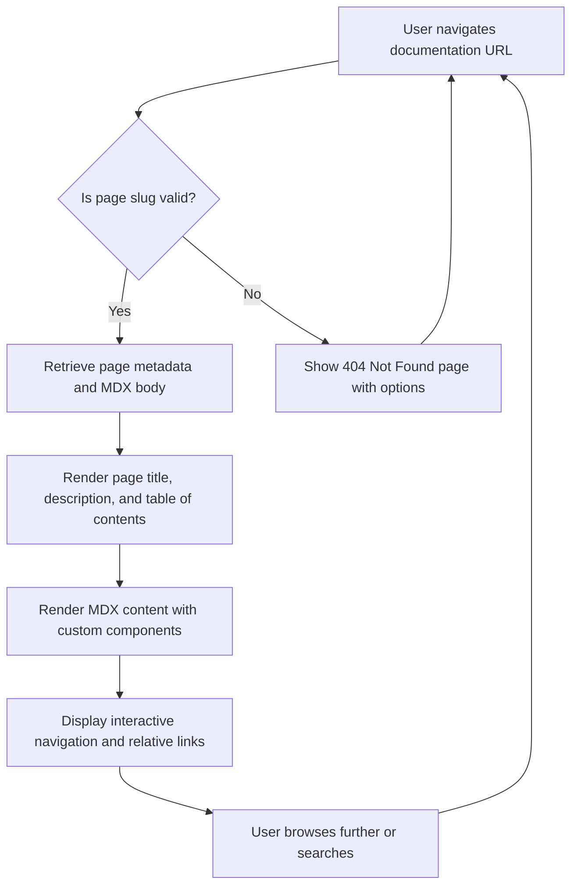

# Navigating Documentation Content

## Overview
This page guides you through effectively browsing, searching, and interacting with the RunRL documentation. It explains how the content is structured, how dynamic page routing operates, and how MDX content and metadata are rendered to optimize your reading experience and usability.

Understanding how to navigate this documentation empowers you to find answers quickly, explore related topics effortlessly, and get the most value from the comprehensive resources available.

---

## 1. How RunRL Documentation Content is Structured

RunRL Docs organizes documentation content within a flexible and dynamic system to provide intuitive navigation and meaningful context.

### Key Concepts:
- **Hierarchical Page Tree:** Documentation pages are arranged in a nested tree structure represented by `source.pageTree`. This allows you to explore topics from broad overviews to detailed technical specifics seamlessly.
- **Page Metadata:** Each page includes structured metadata such as title, description, and table of contents (TOC), supporting easy page summaries and in-page navigation.
- **MDX Content Rendering:** The actual page content is authored in MDX, enabling rich text, embedded React components, and interactive elements.

### Content Flow:
1. When requesting a documentation page, the system retrieves metadata and MDX content based on the URL parameters (`slug`).
2. If a page is not found, it triggers a 404 fallback to help you stay oriented.
3. The page renders with the title, description, TOC, and full body content enhanced with custom MDX components to facilitate cross-linking and enhanced UI behavior.

### Value to You:
This structure ensures that navigation is context-aware and allows you to drill into topics at your own pace while maintaining clear context through metadata and embedded navigation components.

---

## 2. Browsing and Searching Documentation

### Browsing Tips:
- Use the sidebar navigation powered by the documentation tree to quickly jump between sections and related topics.
- The table of contents (TOC) shown on each page helps you navigate within long documents and jump to sections of interest.

### Searching Tips:
- Full-text search is integrated directly into the documentation interface, powered by Orama search.
- Use relevant keywords or phrases to locate topics, API references, or troubleshooting tips instantly.
- Search results link directly to the most relevant sections with highlighted keywords.

### Practical Workflow:
- Start by browsing a high-level overview page for conceptual understanding.
- Use search to narrow down specific configuration or API details.
- Use in-page TOC to navigate lengthy articles efficiently.

---

## 3. How Dynamic Routing and Content Loading Work

RunRL Docs uses dynamic routing based on Next.js capabilities:

- URL paths correspond to nested documentation pages (e.g., `/docs/overview/architecture-features-overview`).
- The system resolves the requested page by matching the path slug against the source content.
- Content is statically generated where possible to ensure fast load times.
- Non-existent pages trigger friendly error handling with a 404 not found.

This dynamic routing allows RunRL Docs to handle deeply nested and complex content hierarchies gracefully without trapping you in dead ends.

---

## 4. Understanding MDX Content and Metadata Rendering

### MDX Content:
- Documentation uses MDX, combining Markdown with React components.
- Enables embedding interactive UI elements, linking dynamically to other pages, and customizing presentation.

### Metadata:
- Each page carries structured metadata such as `title`, `description`, and `toc`.
- Metadata is rendered at the top of the page for clarity and SEO benefits.

### Interactive Links:
- Links inside documentation can be relative and dynamically resolved using the `createRelativeLink` helper.
- This ensures intra-doc linking remains robust even as content moves or changes.

### Benefits:
- A seamless reading experience with interactive content
- Clear page context helping you stay oriented
- Consistent styling and navigation elements across the entire documentation site

---

## 5. Practical Tips for Effective Documentation Navigation

- **Start with high-level overview pages** to build foundational knowledge.
- **Use the sidebar navigation and TOC** to move quickly to relevant sections without scrolling endlessly.
- **Leverage the search bar** with specific keywords when you know precisely what you need.
- **Pay attention to metadata summaries** for quick context about each page’s purpose.
- **Explore related pages** linked through the documentation to deepen your understanding.

---

## 6. Troubleshooting Common Navigation Issues

<AccordionGroup title="Common Navigation Challenges">
<Accordion title="Page Not Found (404) Errors">
If you encounter a 'Page Not Found', ensure:
- The URL is correct and uses the documented slug format.
- You refresh the page to rule out caching issues.
- If you reached here from a link, report the broken link to documentation support.
</Accordion>
<Accordion title="Search Returning No Results">
- Try simplifying or changing your search keywords.
- Use broader terms or check your spelling.
- Browse relevant sections manually if search fails.
</Accordion>
<Accordion title="Sidebar or TOC Not Displaying Correctly">
- Verify your screen size — responsive behavior may hide navigation on smaller screens.
- Try refreshing your browser or clearing cache.
- Contact support if the problem persists.
</Accordion>
</AccordionGroup>

---

## 7. Summary Diagram: Documentation Content Flow

---

## 8. Next Steps & Related Documentation

To continue your journey mastering RunRL Docs navigation and usage, consider exploring:

- [Installing and Setting Up RunRL Docs](/guides/getting-started/installation): How to set up the project locally and understand its structure.
- [System Architecture](/overview/architecture-features-overview/system-architecture): Visualize how documentation components interact.
- [Feature Overview](/overview/architecture-features-overview/feature-overview): Understand core functionalities supporting navigation and content.
- [Authoring and Managing MDX-Based Documentation](/guides/usage-patterns/authoring-mdx): Learn how to create or customize documentation content.

---