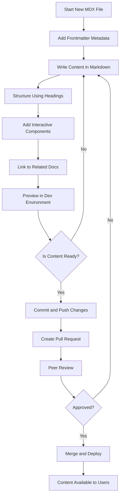

# Authoring and Managing MDX-Based Documentation

## Overview
This guide provides you with clear, actionable instructions for creating, updating, and maintaining high-quality MDX-based documentation using the RunRL Docs platform. You will learn how documentation files are structured, best practices for content consistency and clarity, as well as collaborative workflows that ensure your docs remain reliable and easy to navigate.

Whether you are starting a new document or maintaining existing pages, this guide will enable you to deliver compelling and maintainable content aligned with RunRL Docs conventions.

---

## 1. Understanding MDX Documentation Structure

MDX combines Markdown and JSX components, enabling you to write rich documentation that integrates interactive UI elements seamlessly.

### Key Components of MDX Documentation:
- **Frontmatter**: YAML-like metadata at the top of each MDX file that defines page title, description, and schema-based metadata. This ensures consistent presentation and search indexing.
- **Body Content**: Standard Markdown combined with React components for enhanced functionality (coding examples, alerts, cards).
- **TOC & Headings**: Structure your content using heading levels (`#`, `##`, `###`, etc.) to create an automatic Table of Contents.

### File Location and Naming:
- Place your `.mdx` files within the designated content directories as specified by the source configuration.
- File names should be descriptive and kebab-case to promote URL readability.

### Example Frontmatter:
```yaml
---
title: 'Getting Started with RunRL Docs'
description: 'An introduction to installing and configuring RunRL Docs.'
---
```

<Tip>
Always add clear and concise `title` and `description` fields to your frontmatter for SEO and user clarity.
</Tip>

---

## 2. Creating and Updating Content

Follow this step-by-step user flow for adding or updating documentation:

<Steps>
<Step title="Create the MDX File">
Start by creating a new `.mdx` file in the appropriate content folder mirroring the topic area. Use meaningful file names that reflect the content's focus.
</Step>
<Step title="Add Frontmatter Metadata">
Add the frontmatter block at the top to define the page title and description. These will appear in the site's header and help users find content.
</Step>
<Step title="Write Content Using Markdown and Components">
Use markdown syntax to write your text. Enhance your content with UI components (alerts, cards, code blocks) from the component library to improve readability and engagement.
</Step>
<Step title="Structure Headings for Navigation">
Arrange content with hierarchical headings to enable automatic Table of Contents generation — this helps users and supports navigation.
</Step>
<Step title="Link to Related Pages Relatively">
Use relative links to interconnect documentation pages. This ensures links remain valid even when moving files or restructuring.
</Step>
<Step title="Review and Preview">
Use local development tools (`npm run dev`) to preview your page in context. Check formatting, interactivity, and navigation.
</Step>
<Step title="Commit and Collaborate">
Commit your changes with a descriptive message. Use pull requests to review and discuss changes with your team.
</Step>
</Steps>

<Check>
Verify your new or updated pages appear correctly in the navigation sidebar and the search index.
</Check>

---

## 3. Collaboration and Consistency Best Practices

Maintaining quality documentation demands collaboration and adherence to conventions:

- **Standardize Frontmatter**: Agree on essential metadata fields and their formats across all documentation files.
- **Use Shared MDX Components**: Apply standardized UI components consistently for alerts, examples, and tips, ensuring uniform look and feel.
- **Code Example Formatting**: Use fenced code blocks with explicit language tags for syntax highlighting.
- **Review and Approve**: Use pull requests for peer review to catch errors, improve clarity, and maintain a consistent style.
- **Consistent Terminology**: Refer to terms defined in Core Concepts and Terminology documentation to avoid confusion.
- **Keep Content Modular**: Break complex topics into smaller, reusable MDX files linked logically.

<Warning>
Avoid embedding sensitive data or implementation details not meant for public consumption.
</Warning>

---

## 4. Practical Tips for Effective MDX Documentation

- Use clear, user-focused language addressing reader goals.
- Keep paragraphs short and focused.
- Use bullets and numbered lists to organize information.
- Leverage component-based callouts (`<Tip>`, `<Note>`, `<Warning>`) to emphasize important facts or caveats.
- Include real-world usage examples when relevant.

<Example>
A code snippet showcasing how to document a function:
```mdx
---
title: 'Using the RunRL Initialization API'
description: 'Step-by-step guide to initialize the RunRL client.'
---

## Example: Initialization

```python
from runrl import RunRLClient
client = RunRLClient(api_key='YOUR_KEY')
print(client.status())
```

<Tip>
Replace ‘YOUR_KEY’ with your actual API key.
</Tip>
```

---

## 5. Troubleshooting Common Issues

<AccordionGroup title="Common Issues in MDX Authoring">
<Accordion title="Metadata Not Displaying Correctly">
Ensure that frontmatter is correctly formatted with proper YAML syntax (no tabs, use spaces) and is at the start of the file.
</Accordion>
<Accordion title="Broken Links Between Pages">
Verify relative paths and use the provided link helper functions when linking between pages. Avoid hardcoding absolute paths.
</Accordion>
<Accordion title="Page Not Showing Up in Navigation">
Check that your MDX files are saved in the correct content directory as per the `source.config.ts` settings and that the file's frontmatter includes a title.
</Accordion>
<Accordion title="Formatting or Components Not Rendering">
Confirm your development server is running and the MDX components library is correctly imported. Restart if caches cause stale renders.
</Accordion>
</AccordionGroup>

---

## 6. Next Steps & Additional Resources

Now that you understand how to author and manage MDX documentation effectively, consider exploring these related guides:

- **[Installation Guide](/guides/getting-started/installation)**: Learn how to set up your local documentation environment.
- **[Basic Navigation](/guides/getting-started/basic-navigation)**: Understand how users will browse your documentation.
- **[Configuration Basics](/getting-started/setup-introduction/configuration-basics)**: Customize frontmatter schema and MDX rendering.
- **[Troubleshooting Common Issues](/guides/usage-patterns/troubleshooting)**: Handle advanced debugging scenarios.

Use collaborative tools such as GitHub workflows and pull request templates to maintain high standards and smooth teamwork.

---

## Summary Diagram: MDX Authoring Workflow



---

This workflow visualizes your authoring process from creation to deployment, emphasizing iterative improvement and team collaboration.


