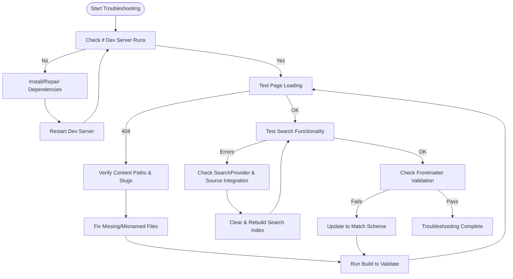

# Troubleshooting Common Issues

This guide serves as your essential reference for diagnosing and resolving frequent issues encountered when building, deploying, or consuming RunRL documentation. By following the structured debugging workflows, interpreting error messages accurately, and applying practical fixes, you will maintain a smooth and effective documentation experience.

---

## 1. Workflow Overview

### Purpose
This page helps you quickly identify problems and apply step-by-step solutions related specifically to RunRL documentation. It covers common pitfalls across installation, content rendering, search functionality, and content navigation.

### Prerequisites
- RunRL documentation project cloned and set up locally
- Basic familiarity with npm/pnpm/yarn commands
- Access to development logs and browser console

### Expected Outcome
- Identify root causes of frequent errors
- Apply fixes or workarounds effectively
- Gain confidence in maintaining documentation health

### Time Estimate
15-30 minutes per issue, depending on complexity

### Difficulty Level
Intermediate - appropriate for users who have completed initial setup and are authoring or deploying docs

---

## 2. Step-by-Step Troubleshooting Instructions

### Issue 1: Development Server Won't Start

**Symptoms:**
- Running `npm run dev` fails silently or throws errors
- Browser at `http://localhost:3000` does not load

**Steps:**
1. Ensure Node.js version is compatible with Next.js requirements.
2. Check that dependencies are installed without errors: run `npm install` or `pnpm install`.
3. Inspect error output in the terminal for missing packages or permission issues.
4. Clear `.next` build cache by deleting the `.next` folder and restart.
5. Verify `next.config.mjs` file does not contain syntax errors.

**Success Check:** Development server logs indicate listening on port 3000 with no errors.

### Issue 2: Documentation Pages Not Rendering or 404 Errors

**Symptoms:**
- Navigating to docs pages results in "Page Not Found"
- Dynamic routes do not resolve correctly

**Steps:**
1. Confirm your content files exist in the expected location (`content/docs` folder).
2. Verify `source.config.ts` and `source.config.mjs` correctly define `defineDocs` and schema.
3. Check slug paths used for navigation match the files exactly, including case sensitivity.
4. Run `npm run dev` and watch for warnings about unresolved pages.
5. Test static generation by running `npm run build` to catch errors in page generation.

**Success Check:** Pages load successfully in development and production builds without 404.

### Issue 3: Search Functionality Returns No Results or Errors

**Symptoms:**
- Search queries return empty results despite existing content.
- Console errors related to Orama search or indexing.

**Steps:**
1. Confirm the `SearchProvider` from `fumadocs-ui/search` is properly included in the app layout (`app/layout.tsx`).
2. Verify that `source` code in `rldocs/.source/index.ts` integrates all docs content modules.
3. Ensure that content files contain valid frontmatter metadata to be indexed.
4. Clear and rebuild the search index if applicable.

**Success Check:** Search yields relevant results matching query terms.

### Issue 4: Frontmatter Validation Errors or Schema Mismatches

**Symptoms:**
- Build fails due to frontmatter issues
- Warning logs about schema validation

**Steps:**
1. Review frontmatter sections in your MDX files; verify required fields (like `title`, `description`) are present.
2. Compare frontmatter against the schema defined in `source.config.ts` (`frontmatterSchema`).
3. Use a JSON schema validator or linter to sanity check frontmatter format.
4. Update schema definitions if custom frontmatter fields are introduced.

**Success Check:** Builds complete without schema or validation warnings.

---

## 3. Real-World Examples and Scenarios

### Example: Fixing a Missing Documentation Page

You cloned the RunRL docs repo and noticed that clicking links to the "Installation Guide" triggers a 404.

- **Action:** Check if `content/docs/installation.mdx` exists.
- **If missing:** Add or restore the file.
- **If present:** Verify that the frontmatter includes a correct `title` and no typos.
- **Check:** Confirm that dynamic slug routing in `app/docs/[[...slug]]/page.tsx` is functioning as expected.

Outcome: After restoring the page file and ensuring frontmatter validity, the link resolves correctly.

### Example: Resolving Search Errors in Console

After adding new content, search throws errors or returns no results.

- **Action:** Make sure `SearchProvider` wraps documentation components in `app/layout.tsx`.
- **Action:** Verify the integration of all MDX docs via the source adapter in `.source/index.ts`.
- **Fix:** Rebuild and clear caches.

Outcome: Search results update properly to include new content.

---

## 4. Troubleshooting & Best Practices

### Common Issues & Fixes

<AccordionGroup title="Common Troubleshooting Topics">
<Accordion title="Node.js Version Conflicts">
Ensure your Node.js version matches the supported range for Next.js and other dependencies. Use `node -v` to check and upgrade if below required.
</Accordion>
<Accordion title="Incorrect Document Paths">
Maintain consistent file naming and folder structure in `content/docs`. MDX filenames must align with slug routing to avoid 404s.
</Accordion>
<Accordion title="Schema Validation Failures">
Keep frontmatter updated with required fields. Use the `source.config.ts` schema as your validation reference.
</Accordion>
<Accordion title="Cache-Related Problems">
Regularly clear `.next` and browser caches during development to avoid stale errors.
</Accordion>
</AccordionGroup>

### Best Practices

- Commit incremental changes when modifying docs source to isolate errors quickly.
- Use consistent frontmatter metadata for reliable search and rendering.
- Monitor console and terminal output closely for warnings and errors.
- Leverage `npm run build` regularly to catch static generation issues early.

### Performance Considerations

- Avoid overly large MDX files to keep rendering fast.
- Use frontmatter and metadata to optimize content indexing.
- Keep dependencies up to date to benefit from improvements in Next.js and Fumadocs.

### Alternative Approaches

- For persistent 404s, consider running a minimal repro by removing recent changes.
- Use static export or serverless deployment logs to diagnose runtime issues.

---

## 5. Next Steps & Related Content

### What's Next
- Review [Installation Guide](/getting-started/setup-introduction/installing-runrl) if setup issues persist.
- Explore [Troubleshooting Setup Issues](/getting-started/first-steps/troubleshooting) for early-stage problem resolution.
- Advance to [Authoring and Managing MDX-Based Documentation](/guides/usage-patterns/authoring-mdx) for better content control.

### Related Guides and References
- [Basic Navigation of Documentation Content](/guides/getting-started/basic-navigation)
- [API Reference](api-reference) for exploring core docs APIs
- [Authentication and Authorization Guides](/guides/usage-patterns/authentication-docs)

### Support Resources
- Official Next.js and Fumadocs documentation sites
- GitHub issues at [https://github.com/runrl/docs](https://github.com/runrl/docs) for community help

---

## Contact & Help
If your issue is not covered here, consider opening an issue with detailed logs and error descriptions in the RunRL docs GitHub repository.

---

### Summary Diagram: Typical Troubleshooting Flow

---