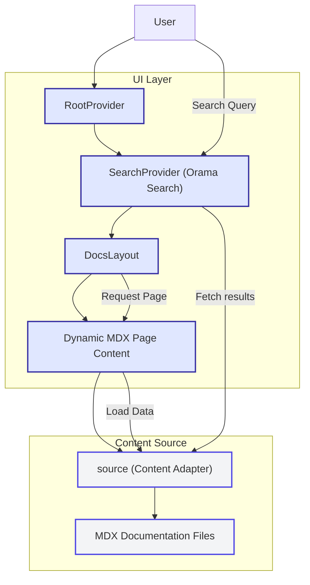

# System Architecture

The System Architecture page offers a clear, visual map of RunRL Docs’ core components and their interactions. Designed to help you grasp how the major pieces connect and work together, this page uses a detailed Mermaid diagram to illustrate the system's architecture, enabling a confident and holistic understanding of the documentation experience.

---

## Why Understanding System Architecture Matters

As a user — whether you're setting up, developing, or simply exploring RunRL Docs — knowing the architecture helps you anticipate how changes ripple through the system. It empowers you to troubleshoot effectively, optimize your workflows, and extend the platform with confidence.

---

## What You Will Find Here

- **A Visual Diagram:** A Mermaid.js flowchart representing the main components and their relationships.
- **Component Interactions:** A description of how key services connect to deliver seamless documentation.
- **User Flow Insights:** Understanding how your actions translate through the system to results.

---

## High-Level Architecture Overview

RunRL Docs is a modern, React and Next.js-based documentation platform powered by Fumadocs UI and orchestrated with Orama search capabilities for efficient content retrieval. The high-level layout is simple yet powerful:

- **RootProvider:** Wraps the entire application to provide shared UI state and context.
- **SearchProvider:** Integrates Orama's full-text search, optimized for dark mode.
- **DocsLayout:** Presents documentation content structured by the source content tree.

Together, these components form a responsive, extensible environment for managing and displaying reinforcement-learning documentation.

---

## Core Components and Their Roles

### 1. RootProvider

RootProvider anchors global UI state management and shared context across the app, enabling consistent user experiences including navigation, theming, and layout.

### 2. SearchProvider

Powered by Orama, the SearchProvider manages powerful full-text search features. It is dark-mode aware, ensuring accessibility and usability at all times.

### 3. Source Content

The `source` module bridges your raw documentation content (MDX files) with the app, offering page data, navigation trees, and metadata for smooth rendering and linking.

### 4. DocsLayout

DocsLayout consumes the source content structure and renders the documentation pages within a user-friendly layout. It handles the sidebar, page hierarchy, and content structure.

### 5. Page Components

Each documentation page is dynamically loaded and rendered from MDX content, enhanced by custom components that provide relative linking and rich interactivity.

---

## How the Pieces Connect

This flowchart shows how the UI layer (RootProvider, SearchProvider, DocsLayout, and page rendering) interacts with the source layer of your MDX files. The source adapter is responsible for fetching and providing page data to the UI components, ensuring dynamic and responsive content display.

---

## Real-World Scenario: Viewing a Documentation Page

1. **Request:** You navigate to a documentation page.
2. **Routing & Layout:** The DocsLayout uses the source’s page tree to organize navigation and structure.
3. **Content Loading:** The MDX content for the page is dynamically loaded through the source adapter.
4. **Rendering:** The page is rendered with all custom components and relative links properly linked.
5. **Search Ready:** If you perform a search, the SearchProvider uses the Orama engine to instantaneously retrieve relevant results.

This seamless flow ensures you get fast, well-structured documentation without delays or inconsistencies.

---

## Practical Tips

- **For Developers:** Understanding this architecture helps in extending or customizing components, adding new providers, or integrating new content sources.
- **For Editors:** Knowing the role of `source` and MDX files clarifies how your content changes affect the site.
- **For Troubleshooting:** If pages fail to load, inspect the content source and its integration with the layout components.

---

## Common Pitfalls & Troubleshooting

- **Page Not Found:** Usually caused by issues in the content source adapter or broken MDX files.
- **Search Malfunction:** Check that SearchProvider is properly wrapping the app and that Orama data is correctly indexed.
- **Layout Breaks:** Ensure the RootProvider and DocsLayout wrap content correctly and that CSS imports are intact.

---

## Next Steps

To deepen your understanding and start working effectively with RunRL Docs, explore:

- [Feature Overview](/overview/architecture-features-overview/feature-overview): Discover what features RunRL Docs offers beyond architecture.
- [What Is This Product?](/overview/introduction-core-concepts/product-intro-value): Learn about the product’s purpose and audience.
- [Installation Guide](/getting-started/setup-introduction/installing-runrl): Start your hands-on experience.

By mastering the system architecture, you set a strong foundation for leveraging the full power of RunRL Docs.

---

<System Architecture Diagram By User Request>

