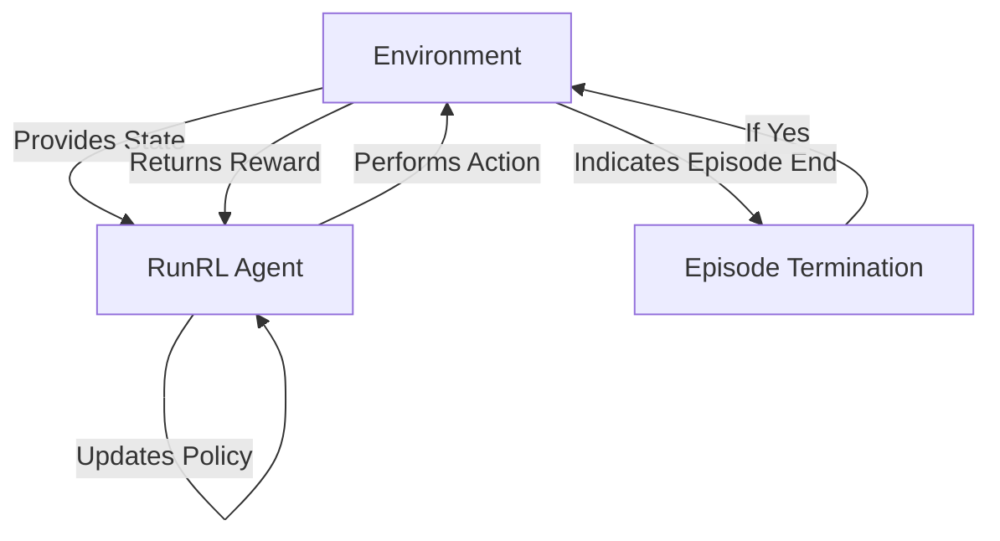

# Core Concepts & Terminology

## Unlocking the Foundation of RunRL Docs

Welcome to the section that sets the stage for your entire RunRL Docs experience. Here, we introduce you to the essential terms, concepts, and mental models you need to confidently navigate the product’s features and documentation. Think of this page as the compass that guides you through the rich landscape of reinforcement learning utilities for real-world robotics.

---

## Why This Matters

Before diving into advanced workflows or detailed API references, understanding the core concepts ensures you are fluent in the language and ideas that RunRL Docs uses. This shared vocabulary unlocks smoother communication, faster learning, and more successful use of the product.

---

## What You Will Learn Here

- The key terminology that forms the backbone of RunRL Docs.
- Foundational concepts you need to grasp before using features effectively.
- Mental models that will help you think about how the product operates and how you interact with it.

---

## Core Terminology

Below are the primary terms you will encounter frequently in RunRL Docs:

- **Reinforcement Learning (RL)**: A learning paradigm where agents learn to make decisions by taking actions and receiving feedback through rewards.

- **RunRL Agent**: The autonomous software entity trained to perform tasks using RL within your robotic environment.

- **Environment**: The simulated or real-world setting in which the RunRL Agent operates and learns.

- **Policy**: The strategy or mapping that the agent uses to decide actions based on current state information.

- **Reward Signal**: Numeric feedback the agent receives after taking an action, guiding its learning process.

- **Training Episode**: A complete cycle where an agent starts operating within the environment, performs actions, collects rewards, and either succeeds or ends.

- **State**: The current representation of the environment's condition perceived by the agent.

- **Action Space**: The range of possible actions the agent can take at any given state.

- **Episode Termination**: The conditions or events that cause the training episode to end.

<Note>
Understanding these terms will help you follow feature explanations and tutorials without confusion or guesswork.
</Note>

---

## Foundational Concepts

These mental frameworks clarify how the RunRL Docs product is structured and how you can interact with it:

### 1. Agent-Environment Loop

At the heart of reinforcement learning—and your interaction with RunRL Docs—is the continuous cycle where your RunRL Agent observes the state of the environment, performs an action, and receives a reward or penalty. This cycle repeats until the episode terminates.

Visualizing this loop helps clarify the flow of data and decisions:

---

### 2. Documentation Navigation & Mental Mapping

This page builds your foundation for understanding the documentation structure:

- **Core Concepts & Terminology**: Your vocabulary and mental models;
- **What Is This Product?**: The ‘why’ and ‘what’ behind RunRL Docs;
- **Target Audience & Use Cases**: Who benefits most and typical scenarios.

By mastering this page first, you will accelerate comprehension of all other documentation content.

---

## How These Concepts Help You

Imagine you are a robotics engineer setting up your first RunRL experiment. Knowing the terminology guides you through recognizing what "policy" or "reward signal" means when reading setup instructions or troubleshooting.

For example:

- When you read about "Training Episodes," you know this refers to a full cycle of agent learning, helping you set expectations for runtime.
- Understanding "Action Space" lets you grasp the limits of what your agent can do, critical when designing behaviors.

---

## Practical Tips & Best Practices

- **Familiarize yourself with this terminology upfront** to avoid confusion later.
- Refer back to this page whenever you encounter unfamiliar terms.
- Use the mental model of the Agent-Environment loop to trace problems or conceptualize workflows.

---

## Common Pitfalls to Avoid

- **Jumping into configuration or APIs without grounding in core terms** can lead to misunderstanding and errors.
- **Confusing environment states with agent policies**—keep distinct what is sensed vs. what is decided.
- **Assuming terms have universal definitions outside RunRL Docs**—always refer to this glossary for RunRL-specific meanings.

---

## Next Steps

After mastering these core concepts and terms, proceed to:

- [What Is This Product?](../introduction-core-concepts/product-intro-value) to understand the value and purpose of RunRL Docs.
- [Target Audience & Use Cases](../introduction-core-concepts/target-audience-use-cases) to see how other users apply RunRL Docs in real projects.

These pages will build on your foundation, leading you into practical application and advanced insights.

---

Make sure to revisit this page whenever you feel a concept needs reinforcing—it is your key reference for understanding and successfully using RunRL Docs.

---

> "A solid foundation of concepts turns complexity into clarity."

<footer>
---
RunRL Docs Navigation | [Overview](../../overview/introduction-core-concepts) | [Getting Started](../../getting-started/setup-introduction) | [API Reference](../../api-reference/core-api)
</footer>